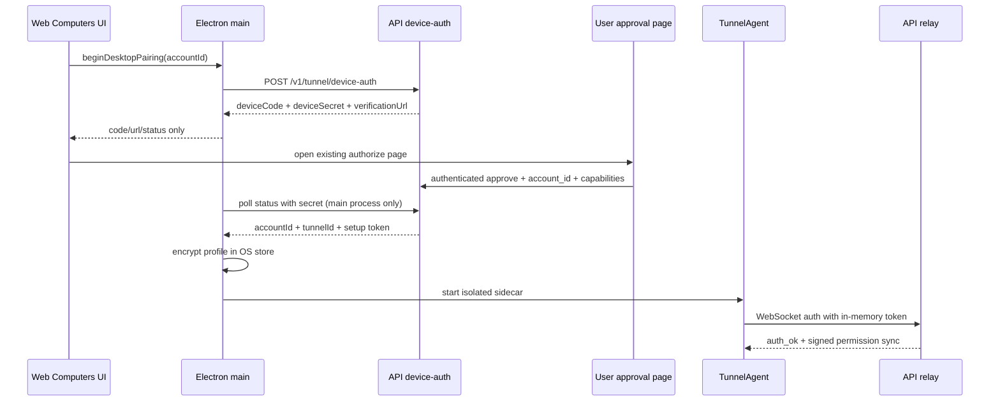

# OpenOPC Desktop Agent Tunnel Control Plane

- **Status:** Architecture direction approved; written specification pending review
- **Date:** 2026-07-29
- **Target:** OpenOPC public beta on Web and Windows Desktop
- **Base:** Kortix remains the upgradeable application base
- **Scope:** Make the existing Desktop local-capability surface use the existing Agent Tunnel execution control plane

## 1. Decision

OpenOPC Desktop will reuse the existing Agent Tunnel as its only remote-to-local
execution path. It will not introduce a second Electron execution stack, a
parallel cloud grant table, or a renderer-owned filesystem/shell API.

The authoritative cloud records remain:

- `tunnel_connections`
- `tunnel_permissions`
- `tunnel_permission_requests`
- `tunnel_audit_logs`
- `tunnel_device_auth_requests`

The existing `executeTunnelRpc` path remains the shared server entry point for
the dedicated tunnel route and the Computer connector. The existing
`TunnelAgent`, `PermissionGuard`, capability factories, signatures, reconnect
behavior, and kill switch remain the transport and server-policy foundation.

Electron adds only a local boundary around that foundation:

1. secure credential storage and device pairing;
2. Agent lifecycle management;
3. native confirmation for high-risk local permissions;
4. a local, short-lived, one-use permit that can only narrow an already-valid
   Tunnel permission;
5. status and audit projection to the Web UI through named IPC methods.

## 2. Product and lifecycle model

The browser is the complete product. It remains usable when no Desktop process,
bridge, daemon, or Desktop secret exists. Desktop adds a paired local execution
node and never becomes a prerequisite for remote work.

Initial pairing is always user initiated from the Desktop Computers surface.
After a successful pairing, the app may resume the Agent automatically only
when all of the following match:

- the current authenticated Web user and selected account;
- the configured application origin;
- the encrypted credential profile;
- the local device identity.

An account switch, origin change, logout, token rotation, explicit unpair, or
secure-storage failure stops the Agent and clears runtime permissions. Stored
credentials are not sent to the renderer and are not shared with the CLI's
`~/.agent-tunnel` configuration.

Pairing is account-owned, not merely user-owned. The Desktop approval request
must carry the explicitly selected `account_id`; the authenticated approval
handler validates membership with `resolveScopedAccountId(c, "body")`, then
checks the required team/device-management permission before creating the
connection. Until a dedicated device-management action exists, the route
reuses the existing account-scoped `account.write` permission for this
mutation. The Desktop poll response includes the resulting `accountId` as non-secret
metadata, and Electron verifies it against the current authenticated account
before persisting the profile. A missing, changed, or non-member account stops
pairing and stores no credential. The existing CLI device flow may omit
`account_id` and retain its legacy primary-account fallback; the Desktop flow
may not.

### State machine

```text
remote_only
   | beginPairing
pairing_pending
   | approved + credential stored
starting
   | WS auth_ok
online
   | permission sync / local confirmation
ready
   | disconnect, logout, rotation, kill switch
stopped_or_reauth_required
```

The UI must distinguish `online` from `ready`: a WebSocket can be connected
while a high-risk permission still lacks local confirmation.

## 3. Component boundaries

### 3.1 OpenOPC-owned Desktop runtime and sidecar

Create a private OpenOPC adapter package (proposed path:
`packages/openopc-desktop-agent`) and a packaged Agent sidecar. The adapter
imports only public `agent-tunnel` exports. It provides:

- `createDesktopTunnelRuntime(options)`;
- `start`, `stop`, `status`, `onStatus`, and `unpair` operations;
- a capability registry containing the existing filesystem, shell, and desktop
  capability factories;
- a `DesktopConsentGuard` wrapper around each capability handler;
- deterministic config construction from the encrypted Desktop profile rather
  than `~/.agent-tunnel`.

The adapter exposes a stable runtime facade rather than requiring Electron to
reach into `TunnelAgent` internals:

```text
createDesktopTunnelRuntime(profile, options) -> {
  start(): Promise<void>
  stop(reason, timeoutMs): Promise<DrainResult>
  status(): DesktopAgentStatus
  onStatus(listener): () => void
  unpair(): Promise<void>
}
```

The status/event contract includes `starting`, `online`, `permissions_synced`,
`disconnected`, `auth_required`, `stopped`, and `error`. The facade must emit
`auth_required` for `tunnel.token.rotated` and WebSocket close code `4001`; it
must not silently reconnect with a stale token. A stopped runtime is not
restarted: the facade creates a fresh `TunnelAgent` instance for the next
start. Any required upstream additions are additive public lifecycle/event
hooks or a `desktop-runtime` export; private fields and repository source
imports are forbidden.

The private adapter build produces two explicit artifacts: a small CJS
controller shim for Electron main and a self-contained sidecar executable.
Electron must not `require` the repository's TypeScript/ESM source directly,
and the installed sidecar must not depend on a system Bun or Node installation.
Both builds use the public package entry point and fail if a source-TS import
is included in a packaged artifact.

Electron main supervises one sidecar instance. At launch it sends a framed,
one-time bootstrap message over the child process stdin containing the
decrypted token and an in-memory control-channel key; neither value appears in
argv, environment, renderer state, or logs. Sidecar-to-main messages are
authenticated with that per-launch key. Native confirmation requests travel
over the same narrow protocol and contain only a permission id, scope digest,
and display-safe metadata. A sidecar crash or malformed frame causes an
immediate stop and runtime-permission invalidation.

The control protocol is versioned and bounded: it has a protocol version,
monotonic per-launch nonce, request id, strict message-type allowlist, a
64-KiB frame limit, and a finite response deadline. Unknown versions,
duplicate nonces, oversized frames, and late responses fail closed and stop
the sidecar. It is not a general-purpose JSON-RPC bridge from the renderer.

The wrapper order is fixed:

```text
TunnelAgent.handleRpcRequest
  -> PermissionGuard.checkRequest (cloud permission, scope, policy fence)
  -> CapabilityRegistry handler
  -> DesktopConsentGuard (local consent and one-use permit)
  -> underlying filesystem/shell/desktop handler
```

No wrapper can grant a missing `permissionId`, change a capability, broaden a
scope, or bypass the Agent's signature and nonce checks.

### 3.2 Electron main process

Add a `TunnelRuntimeController` and `TunnelPairingController` in the Electron
main process. The main process supervises the sidecar and:

- validates the exact configured Web origin before every privileged operation;
- obtains the authenticated user through the existing same-origin desktop
  session endpoint;
- creates and polls device-auth requests using the existing API routes;
- keeps the device secret in memory only while pairing;
- stores `apiOrigin`, `accountId`, `tunnelId`, setup token, user id, and device
  id through Electron `safeStorage`/the OS credential store;
- starts the sidecar only after the authenticated user and stored profile
  match;
- stops and invalidates runtime permissions on logout, account change, origin
  change, token rotation, or app shutdown;
- performs one idempotent, bounded Agent drain from both `before-quit` and
  `will-quit`, and blocks updater installation until that drain completes or
  its deadline expires. The timeout path terminates the sidecar, clears local
  consents, and never prevents the application from exiting;
- treats `autoUpdater.quitAndInstall()` as the same shutdown path, so an update
  cannot replace a live sidecar or leave a stale local permit behind.

No token, permission scope, native confirmation token, sidecar stdin, or
arbitrary IPC command is exposed to the renderer.

### 3.3 Preload and Web

Keep the existing `__TAURI__`, `kortix://`, `KortixDesktop`, and window-control
contracts unchanged. Add a separate, typed, named bridge with only these
operations:

- `getDesktopAgentStatus()`;
- `beginDesktopPairing(accountId)`; // main process revalidates membership
- `cancelDesktopPairing()`;
- `syncDesktopAuthContext(accountIdOrNull)`; // null is sent on logout
- `confirmDesktopPermission(permissionId)`;
- `revokeDesktopConsent(permissionId)`;
- `stopDesktopAgent()`;
- `unpairDesktopAgent()`.

The Web calls `syncDesktopAuthContext` after login, logout, and account
selection changes. The supplied account id is only a hint: Electron re-fetches
the same-origin authenticated session and validates account membership before
retaining a running sidecar. A null, stale, or unauthorized context stops the
runtime immediately.

The Web Computers view keeps the existing Tunnel overview, permission request,
and audit components. It adds a small Desktop status/pairing panel that uses
the named bridge when present and renders a remote-only state otherwise.
Existing local-grant UI and tests remain as a migration compatibility surface
until the adapter is proven; they must not be treated as protection for actual
filesystem, shell, or Desktop execution.

## 4. Pairing and data flow



The device-auth route keeps its existing CLI contract and receives one additive
Desktop contract: the approval body accepts the explicit `account_id`, the
authenticated handler uses the scoped-account resolver, and the approved poll
response adds `accountId`. Existing CLI clients ignore the additive field. The
approval page displays the selected team/account and refuses an implicit
primary-account fallback for Desktop pairing. The setup token is never logged,
placed in a URL, or returned by IPC.

The Computer connector remains the server-side consumer for Agent tasks. Its
selector and account scoping are unchanged; a Desktop Agent simply becomes an
additional live machine behind the existing connector.

## 5. Local consent and full-access semantics

Tunnel permissions are the only authorization source. Local consent is a
fail-closed veto and attestation, not an alternate grant authority.

For every high-risk permission, the local store binds:

```text
tunnelId
permissionId
capability
scopeDigest
authenticatedUserId
deviceId
issuedAt
expiresAt
revokedAt
```

The scope digest is computed from the server-supplied permission after the
Agent has verified the signed message. Renderer-supplied scopes are never used
to create or expand a consent record.

The consent wrapper performs these checks before invoking the underlying
handler:

1. the current user, device, tunnel, permission id, capability, and exact
   scope digest match;
2. the local consent is not expired or revoked;
3. the requested method and params remain inside the server permission scope;
4. a one-use local permit is minted/verified and consumed before execution;
5. a local append-only audit event is written without secret values.

The local permit is short-lived and one-use. It is an implementation detail of
the adapter and is never accepted as a substitute for `permissionId` or the
server-side permission check.

The visible `full_access` mode is a UI bundle over the existing Tunnel
capabilities (`filesystem`, `shell`, and `desktop`). It is not a new cloud
capability. Its local consent is bounded to a maximum of one hour and must be
confirmed again when its scope changes. The cloud cannot silently broaden it.

Server revocation, expiry, token rotation, Agent disconnect, or kill switch
clears local consents immediately. A missing local consent returns a structured
local denial and never triggers a background native prompt.

## 6. Security invariants

- Web-only use never depends on Desktop state.
- Every privileged IPC call is exact-origin gated and re-resolves the current
  authenticated user.
- No renderer or Web page can select a paired public key, device id, storage
  path, capability, root, command, or token.
- Electron uses an isolated profile and never reads/writes `~/.agent-tunnel`.
- The server validates account/team ownership before relay; the Agent validates
  signature, nonce, capability, scope, expiry, policy fences, and kill switch.
- The local wrapper can deny but cannot broaden a cloud permission.
- Token rotation invalidates the stored credential and requires re-pairing;
  stale credentials do not reconnect.
- Safe-storage failure disables local execution rather than falling back to
  plaintext.
- Existing Kortix identifiers and routes remain stable: `@kortix/*`, the
  `kortix` schema, `KORTIX_*` fallbacks, `kortix://`, `KortixDesktop`, and
  existing `/v1` contracts.

## 7. Failure behavior

| Condition | Required behavior |
|---|---|
| API unavailable during pairing | Keep Web usable; show retryable pairing state; store no partial credential |
| Device request expires/denied | Stop polling, clear secret, leave no tunnel profile |
| Web user changes | Stop Agent, clear runtime permissions, require matching profile |
| Web origin changes | Stop Agent and require explicit re-pair for the new origin |
| WS disconnect | Clear local runtime permissions, then use bounded reconnect only while the same profile is valid |
| Permission revoked/expired | Reject immediately and remove local consent |
| Native confirmation canceled | Keep cloud permission unchanged; local execution remains denied |
| Token rotated or WebSocket auth returns `4001` | Atomically stop the sidecar, delete the stale token and all local consents, suppress reconnect, and show re-pair-required state |
| Kill switch | Stop all handlers, clear permissions and consents, record local audit |
| safeStorage unavailable | Expose remote-only mode; never persist plaintext credentials |
| App quit or update install | Await the single bounded drain; on timeout terminate the sidecar and exit without retaining a local permit |

## 8. Compatibility boundary

The following remain compatible and authoritative:

- `packages/agent-tunnel` handshake, signing, reconnect, kill-switch, and
  `PermissionGuard` dispatch;
- API tunnel routes, DB schema, ownership clauses, permission-request and audit
  contracts; the Desktop-only `account_id` request field and `accountId`
  response field are additive and do not alter existing CLI fields;
- Web Tunnel hooks, query keys, SSE invalidation, and existing Computers UI;
- Electron legacy bridge, protocol, user-agent token, app id, and data-dir
  migration behavior.

The only new upstream-facing dependency is an additive public runtime facade
from `agent-tunnel` (or the adapter's pinned compatibility shim). The package
must publish a built `desktop-runtime` artifact; Electron loads only the CJS
controller shim and supervises the self-contained sidecar. Neither artifact
loads `src/*.ts` or an ESM source export at runtime. Any future upstream
upgrade should require changes only in that
build/compatibility shim unless a public API contract changes.

## 9. Verification strategy

Use focused risk-based lanes, not the full monorepo suite.

### Adapter and Electron

- pairing create/status/approve/deny/expiry;
- secret and setup-token non-disclosure to renderer and logs;
- secure profile restore, origin/user binding, account switch, unpair;
- explicit team/account pairing, non-member rejection, and approved-status
  account binding;
- Agent `auth_ok`, permission sync, reconnect, rotation, kill switch;
- rotation notification and `4001` auth failure terminate reconnect and purge
  the stored credential;
- `before-quit`/`will-quit`/`quitAndInstall` drain idempotency and timeout
  behavior;
- wrapper denies without local consent and never invokes the underlying handler;
- exact scope digest, expiry, replay, wrong-user, wrong-device, and revoked
  consent failures;
- built adapter/sidecar artifacts contain no source-TS import, use the pinned
  runtime, and launch on Windows without a system Bun/Node dependency;

### API and Web regression lanes

- existing tunnel auth tiers, account/team ownership, `/rpc` response shapes,
  permission-required request ids, audit, and Computer connector tests;
- Web remote-only behavior with no bridge;
- pairing/status UI with bridge and user-switch guards;
- existing `local-access-panel` contract tests remain green.

### Public-beta evidence

The packaged Desktop smoke belongs to the existing G11 Web/Desktop lane. The
upgrade rehearsal belongs to G12. These gates must prove both Web independence
and a real paired Desktop execution, not merely static rendering or a mock
local grant.

## 10. Rollout

The Desktop Agent runtime is default-off until its focused gates pass. The
release sequence is:

1. ship the adapter build and status-only lifecycle;
2. enable filesystem/shell/desktop handlers behind the local-consent wrapper;
3. run packaged Windows pairing, permission, revoke, rotation, and kill-switch
   evidence;
4. enable the public-beta flag only after G11/G12 evidence and human approval.

No Android/iOS implementation or first-party multimedia product page is part
of this design.
